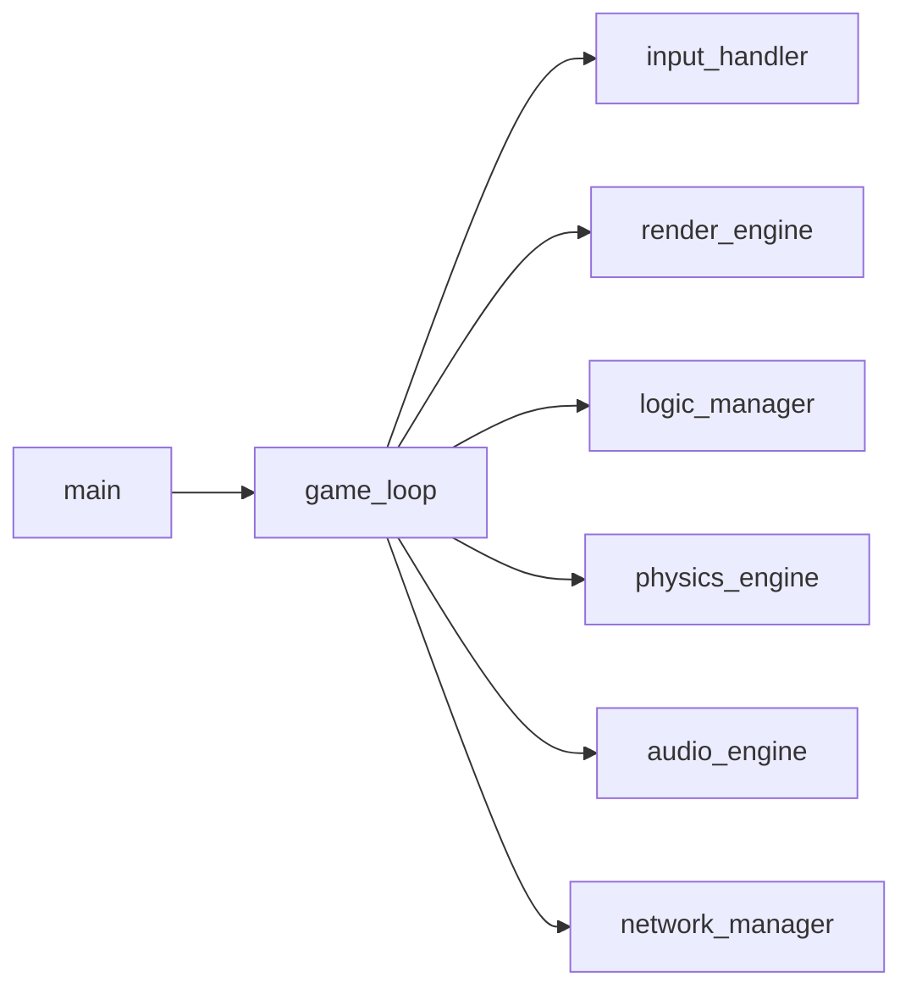

## Основные функциональные требования:
* Графический интерфейс:
  * Поддержка разрешения экрана 1920x1080 пикселей. 
  * Возможность изменения масштаба игрового поля с помощью колесика мыши или горячих клавиш.
  * Панорамирование (перемещение камеры) по игровому полю с помощью клавиш WASD или стрелок.
  * Подсветка выбранных игровых объектов (карт, фишек) при наведении курсора мыши.
* Игровое поле: 
  * Вид сверху-вниз (ортогональная проекция).
  * Карты имеют соотношение сторон 88x63 пикселя.
  * Фишки (каунтеры) представляют собой квадраты размером 1/4 высоты карты.
  * Возможность размещения карт и фишек на игровом поле с точным позиционированием.
* Интерактивность:
  * Выбор карты или фишки путем клика левой кнопки мыши.
  * Перетаскивание выбранного объекта (drag-and-drop) с изменением его положения на игровом поле.
  * Увеличение масштаба выбранного объекта для визуального выделения.
  * Возможность переворота карты или фишки на лицевую или обратную сторону.
  * Вращение карты или фишки на 90 градусов.
* Меню и управление:
  * Главное меню с возможностью выбора режима игры, настроек и выхода.
  * Меню настроек, позволяющее изменять параметры отображения (масштаб, яркость, звук).
  * Горячие клавиши для быстрого доступа к основным функциям (например, поворот карты, выход из игры).
* Механизмы взаимодействия:
  * Реализация правил конкретной настольной игры (если они уже определены).
  * Логика ходов игроков, включая проверку допустимости действий.
  * Управление состояниями игры (начало, ход игрока, конец игры).
* Поддержка многопользовательской игры:
* Локальная игра на одном устройстве с несколькими игроками.
* Возможен вариант сетевой игры с поддержкой подключения других пользователей.
## Новые требования:
## Двухсторонние карты и каунтеры:
* Карты и каунтеры могут иметь два разных изображения – лицевую и оборотную стороны.
* Некоторые карты и каунтеры могут иметь одинаковую оборотную сторону (рубашку), но различающиеся лицевые стороны.
## Колоды:
* Объект "колода" представляет собой набор из двух или более карт.
* Колоду можно тасовать, перемешивая порядок карт внутри неё.
* Карты можно добавлять в колоду и извлекать из нее.
* При извлечении карты из колоды, она может быть открыта (лицевая сторона) или закрыта (оборотная сторона).
## Дополнительные требования:
* Производительность:
  * Оптимизированный рендеринг графики для обеспечения плавной работы даже на слабых устройствах.
  * Минимальное потребление системных ресурсов (память, процессор).
* Кросс-платформенность:
  * Поддержка различных операционных систем (Windows, Linux, macOS).
  * Портативность бинарных файлов без необходимости дополнительной настройки.
* Документированность:
  * Подробная документация по использованию программы и API (если планируется использование сторонними разработчиками).
  * Комментарии в коде для облегчения понимания логики работы программы.
Эти обновленные требования помогут вам учесть все необходимые аспекты при разработке программы моделирования настольной игры.

## Общая схема архитектуры




## Модули
* main.c:
  * Основная точка входа в программу.
  * Инициализирует систему, запускает главный игровой цикл.
* game_loop.c:
  * Главный цикл игры, отвечающий за обновление состояния игры, обработку ввода, рендеринг и другие задачи.
  * Управляет всеми остальными модулями.
* input_handler.c:
  * Обрабатывает ввод от пользователя (мышь, клавиатура, геймпад).
  * Передаёт обработанные события другим модулям.
* render_engine.c:
  * Отвечает за рендеринг графики (игрового поля, карт, фишек и т.д.).
  * Использует библиотеку SDL3 для вывода графики на экран.
* logic_manager.c:
  * Содержит логику игры, включая правила, ходы игроков, проверки условий победы и поражения.
  * Может взаимодействовать с другими модулями для выполнения определённых действий (например, переворот карты).
* physics_engine.c (опционально):
  * Обеспечивает физику взаимодействия объектов (например, столкновение фишек).
  * Может использоваться для симуляции реалистичного поведения объектов.
* audio_engine.c:
  * Воспроизводит звуки и музыку.
  * Интегрируется с SDL_Mixer для управления аудиоэффектами.
* network_manager.c (для многопользовательского режима):
  * Управляет сетевыми соединениями, отправкой и получением данных между клиентами и сервером.
  * Обеспечивает синхронизацию состояний игры между участниками.
## Детализированная структура
### Модуль main.c

```c

#include "game_loop.h"

int main() {
    // Инициализация SDL
    if (SDL_Init(SDL_INIT_VIDEO | SDL_INIT_AUDIO) != 0) {
        fprintf(stderr, "Failed to initialize SDL: %s\n", SDL_GetError());
        return EXIT_FAILURE;
    }

    // Создание главного окна
    SDL_Window* window = SDL_CreateWindow("Настольная Игра",
                                           SDL_WINDOWPOS_CENTERED,
                                           SDL_WINDOWPOS_CENTERED,
                                           1920, 1080, 0);
    if (!window) {
        fprintf(stderr, "Failed to create window: %s\n", SDL_GetError());
        SDL_Quit();
        return EXIT_FAILURE;
    }

    // Создание рендера
    SDL_Renderer* renderer = SDL_CreateRenderer(window, -1, SDL_RENDERER_ACCELERATED);
    if (!renderer) {
        fprintf(stderr, "Failed to create renderer: %s\n", SDL_GetError());
        SDL_DestroyWindow(window);
        SDL_Quit();
        return EXIT_FAILURE;
    }

    // Запуск главного цикла игры
    run_game_loop(renderer);

    // Освобождение ресурсов
    SDL_DestroyRenderer(renderer);
    SDL_DestroyWindow(window);
    SDL_Quit();

    return EXIT_SUCCESS;
}

```

### Модуль game_loop.c

```c

#include "input_handler.h"
#include "render_engine.h"
#include "logic_manager.h"

void run_game_loop(SDL_Renderer* renderer) {
    bool quit = false;
    while (!quit) {
        // Обработка ввода
        process_input();
        
        // Обновление логики игры
        update_logic();
        
        // Рендеринг сцены
        render_scene(renderer);
        
        // Обновление экрана
        SDL_RenderPresent(renderer);
    }
}

```

### Модуль input_handler.c

```c

#include <SDL.h>

void process_input() {
    SDL_Event event;
    while (SDL_PollEvent(&event)) {
        switch (event.type) {
            case SDL_QUIT:
                // Выход из игры
                break;
            case SDL_KEYDOWN:
                // Обработка нажатий клавиш
                break;
            case SDL_MOUSEBUTTONDOWN:
                // Обработка кликов мыши
                break;
            // Другие типы событий...
        }
    }
}

```

### Модуль render_engine.c

```c
#include <SDL.h>

void render_scene(SDL_Renderer* renderer) {
    // Очистка экрана
    SDL_SetRenderDrawColor(renderer, 0, 0, 0, 255);
    SDL_RenderClear(renderer);
    
    // Отрисовка игровых объектов
    for (int i = 0; i < num_objects; ++i) {
        render_object(objects[i], renderer);
    }
    
    // Обновление экрана
    SDL_RenderPresent(renderer);
}
## Модуль logic_manager.c

void update_logic() {
    // Обновление состояния игры
    // Применение правил игры
    // Проверка условий победы/поражения
}

```

Это пример того, как можно организовать архитектуру настольной игры на чистом Си. Такая структура позволяет легко управлять различными компонентами игры и расширять функционал по мере необходимости.
